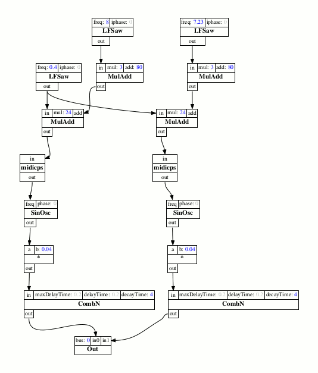

# ScalaCollider-DOT

A utility that translates a [ScalaCollider](https://github.com/Sciss/ScalaCollider) UGen graph into a GraphViz .dot file.
This project is (C)opyright 2016&ndash;2017 by the Institute of Electronic Music and Acoustics (IEM), Graz. Written by Hanns Holger Rutz. This software is published under the GNU Lesser General Public License v2.1+.

See `src/test` for an example usage.

## linking

The following artifact is available from Maven Central:

    "at.iem" %% "scalacollider-dot" % v

The current stable version `v` is `"0.4.1"`.

## building

This project builds with sbt 0.13 and Scala 2.12, 2.11, 2.10. To compile `sbt test:compile`.
To print the test output, `sbt test:run`.

## contributing

Please see the file [CONTRIBUTING.md](CONTRIBUTING.md)
